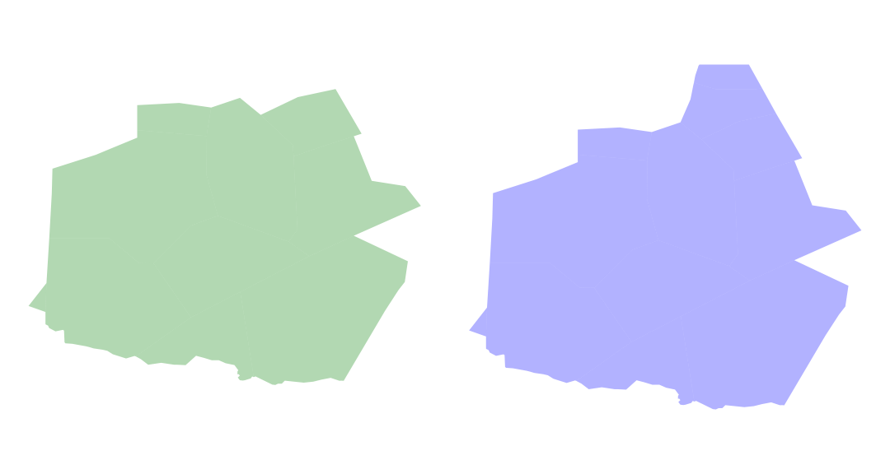

# Airspace ENV to GeoJSON

Build GeoJSON files from airspace environment data (ex: for air traffic sectors)

Airspace Environment data can be found in EUROCONTROL DDR2 web portal (Dataset Files/Airspace Environment Datasets)

Airspace data are managed with [pandas](https://pandas.pydata.org/) / [GeoPandas](http://geopandas.org/) dataframes

Under the hood, geometry and plotting use shapely and Matplotlib libraries. 

Example: plotting of the UBDX airspace at two levels (FL195 and FL345)

## Running the tests

Run the demo notebook to see how to build a GeoJSON file from airspace environment data

## Built With

* [pandas](https://pandas.pydata.org/) - Python Data Analysis Library

* [GeoPandas](http://geopandas.org/) - GeoPandas is an open source project which extends the datatypes used by pandas to allow spatial operations on geometric types. 

## Authors

* **Thomas Dubot** 

## License

This project is licensed under the MIT License - see the [LICENSE.md](LICENSE.md) file for details

## Acknowledgments

Thanks to https://github.com/xoolive/ for showing which files were relevant in the airspace environment data